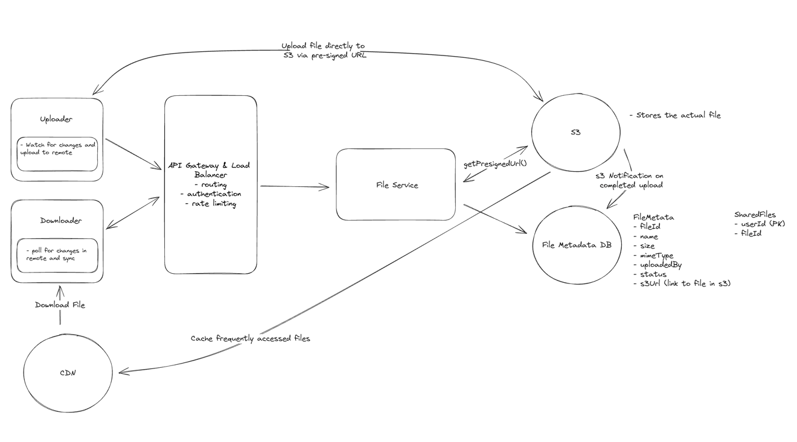
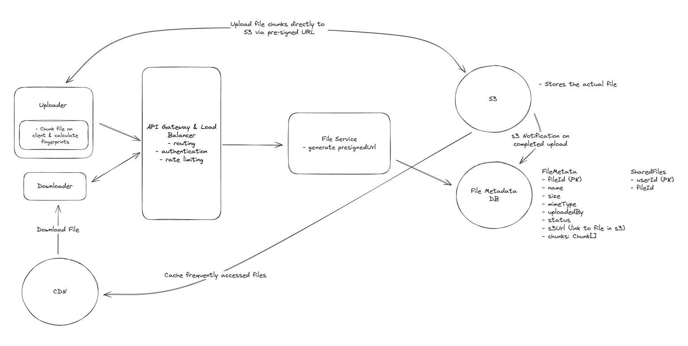

## Functional Requirements
### Core Requirements
- Users should be able to upload a file from any device
- Users should be able to download a file from any device
- Users should be able to share a file with other users and view the files shared with them
- Users can automatically sync files across devices

### Below the line (out of scope):
- Users should be able to edit files
- Users should be able to view files without downloading them

---

## Non-Functional Requirements
### Core Requirements
- The system should be highly available (prioritizing availability over consistency).
- The system should support files as large as 50GB.
- The system should be secure and reliable. We should be able to recover files if they are lost or corrupted.
- The system should make upload, download, and sync times as fast as possible (low latency).

### Below the line (out of scope):
- The system should have a storage limit per user
- The system should support file versioning
- The system should scan files for viruses and malware

---

## Defining the Core Entities
I like to start with a broad overview of the primary entities. At this stage, it is not necessary to know every specific column or detail. We will focus on these intricacies later when we have a clearer grasp of the system (during the high-level design). Initially, establishing these key entities will guide our thought process and lay a solid foundation as we progress towards defining the API.

For Dropbox, the primary entities are incredibly straightforward:
- File: This is the raw data that users will be uploading, downloading, and sharing.
- FileMetadata: This is the metadata associated with the file. It will include information like the file's name, size, mime type, and the user who uploaded it.
- User: The user of our system.

---

## API or System Interface
The API is the primary interface that users will interact with. It's important to define the API early on, as it will guide your high-level design. We just need to define an endpoint for each of our functional requirements.

Starting with uploading a file, we might have an endpoint like this:

```
POST /files
Request:
{
  File, 
  FileMetadata
}
```

To download a file, our endpoint can be:

```
GET /files/{fileId} -> File & FileMetadata
```

To share a file, we might have an endpoint like this:

```
POST /files/{fileId}/share
Request:
{
  User[] // The users to share the file with
}
```

Lastly, we need a way for clients to query for changes to files on the remote server. This way we know which files need to be synced to the local device.

```
GET /files/changes?since={timestamp} -> ChangeEvent[]
```

Each ChangeEvent includes the fileId, the type of change (created, updated, deleted), and the updated metadata. By passing a since timestamp, the client can efficiently fetch only the changes that have occurred since its last sync.

---

## High-Level Design
### 1) Users should be able to upload a file from any device

The main requirement for a system like Dropbox is to allow users to upload files. When it comes to storing a file, we need to consider two things:

1. Where do we store the file contents (the raw bytes)?
2. Where do we store the file metadata?

For the metadata, we can use a NoSQL database like DynamoDB. DynamoDB is a fully managed NoSQL database hosted by AWS. Our metadata is loosely structured, with few relations and the main query pattern being to fetch files by user. 

Our schema will be a simple document and can start with something like this:

```
{
"id": "123",
"name": "file.txt",
"size": 1000,
"mimeType": "text/plain",
"uploadedBy": "user1"
}
```

The best approach is to allow the user to upload the file directly to Blob Storage from the client. This is faster and cheaper than uploading the file to our backend first. We can use presigned URLs to generate a URL that the user can use to upload the file directly to the Blob Storage service. Once the file is uploaded, the Blob Storage service will send a notification to our backend so we can save the metadata.

Presigned URLs are URLs that give the user permission to upload a file to a specific location in the Blob Storage service. We can generate a presigned URL and send it to the user when they want to upload a file. So whereas our initial API for upload was a POST to /files, it will now be a three step process:

1. Request a pre-signed URL from our backend (which generates the URL using the S3 SDK) and save the file metadata in our database with a status of "uploading."
```
POST /files/presigned-url -> PresignedUrl
Request:
{
FileMetadata
}
```

2. Use the presigned URL to upload the file to Blob Storage directly from the client. This is via a PUT request directly to the presigned URL where the file is the body of the request.

3. Once the file is uploaded, the Blob Storage service will send a notification to our backend using S3 Notifications. Our backend will then update the file metadata in our database with a status of "uploaded".

---

### 2) Users should be able to download a file from any device
 
The next step is making sure users can download their saved files. Just like with uploads, there are a few different ways to approach this.

The best approach is to use a content delivery network (CDN) to cache the file closer to the user. A CDN is a network of servers distributed across the globe that cache files and serve them to users from the server closest to them. This reduces latency and speeds up download times.
When a user requests a file, we can use the CDN to serve the file from the server closest to the user. This is much faster than serving the file from our backend or the Blob Storage service.
For security, just like with our S3 presigned URLs, we can generate a URL that the user can use to download the file from the CDN. This URL will give the user permission to download the file from a specific location in the CDN for a limited time. 

#### Challenges

CDNs are relatively expensive. To address this, it is common to be strategic about what files are cached and for how long. We can use a cache control header to specify how long the file should be cached in the CDN. We can also use a cache invalidation mechanism to remove files from the CDN when they are updated or deleted. This way, only files that are frequently accessed are cached and we don't waste money caching files that are rarely accessed.

---

### 3) Users should be able to share a file with other users
To round out the functional requirements, we need to support sharing files with other users. We will implement this similarly to Google Drive, where you just need to enter the email address of the user you want to share the file with. We can assume users are already authenticated.

The main consideration here in an interview is how you can make this process fast and efficient. Let's break it down.

A great approach is to fully normalize the data. This would involve creating a new table that maps userId to fileId, where fileId is a file shared with the given user. This way, when a user opens our site, we can quickly get the list of files shared with them by querying the SharedFiles table for all of the files with a userId of the user.

So you would create a new table, SharedFiles, that looks like this:

```
| userId (Partition Key) | fileId (Sort Key) |
|-------------|-------------|
| user1       | fileId1     |
| user1       | fileId2     |
| user2       | fileId3     |
```

Here, userId and fileId together form a composite primary key, allowing the same user to have multiple files shared with them. In DynamoDB terms, you'd use userId as the partition key and fileId as the sort key. In a SQL database, you'd create a composite primary key on both columns.

In this design, we no longer need the sharelist in the file metadata. We can simply query the SharedFiles table for all of the files that have a userId matching the requesting user, removing the need to keep the sharelist in sync with the sharedFiles list.

---

### 4) Users can automatically sync files across devices
Last up, we need to make sure that files are automatically synced across different devices. At a high level, this works by keeping a copy of a particular file on each client device (locally) and also in remote storage (i.e., the "cloud"). As such, there are two directions we need to sync in:

1. Local -> Remote
2. Remote -> Local

#### Local -> Remote
When a user updates a file on their local machine, we need to sync these changes with the remote server. We consider the remote server to be the source of truth, so it's important that we get it consistent as soon as possible so that other local devices can know when there are changes they should pull in.

To do this, we need a client-side sync agent that:

1. Monitors the local Dropbox folder for changes using OS-specific file system events (like FileSystemWatcher on Windows or FSEvents on macOS)
2. When it detects a change, it queues the modified file for upload locally
3. It then uses our upload API to send the changes to the server along with updated metadata
4. Conflicts are resolved using a "last write wins" strategy - meaning if two users edit the same file, the most recent edit will be the one that's saved
   
Remote -> Local

For the other direction, each client needs to know when changes happen on the remote server so they can pull those changes down.

There are two main approaches we could take:
1. Polling: The client periodically asks the server "has anything changed since my last sync?" The server would query the DB to see if any files that this user is watching has a updatedAt timestamp that is newer than the last time they synced. This is simple but can be slow to detect changes and wastes bandwidth if nothing has changed.
2. WebSocket or SSE: The server maintains an open connection with each client and pushes notifications when changes occur. This is more complex but provides real-time updates.

For Dropbox, we can use a hybrid approach. Each client maintains a single WebSocket (or SSE) connection to the server, not one per file, but one per device/session. Through this connection, the server pushes change notifications for files the user has access to. The hybrid part comes in with how we handle reliability:
- Active notification: The server pushes change events through the WebSocket connection in real-time as they happen. This gives us near-instant sync for any file change.
- Periodic polling as a safety net: WebSocket connections can drop, and messages can be missed. To handle this, the client also periodically polls the server (e.g., every few minutes) using GET /files/changes?since={timestamp} to catch any changes it might have missed. This ensures eventual consistency even if the WebSocket connection was temporarily interrupted.

This hybrid approach gives us the best of both worlds — real-time updates through push notifications, with polling as a reliable fallback to guarantee no changes are ever lost.

---

### Tying it all together

Let's take a step back and look at our system as a whole. At this point, we have a simple design that satisfies all of our functional requirements.



- __Uploader__: This is the client that uploads the file. It could be a web browser, a mobile app, or a desktop app. It is also responsible for proactively identifying local changes and pushing the updates to remote storage.
- __Downloader__: This is the client that downloads the file. Of course, this can be the same client as the uploader, but it doesn't have to be. We separate them in our design for clarity. It is also responsible for determining when a file it has locally has changed on the remote server and downloading these changes.
- __LB & API Gateway__: This is the load balancer and API Gateway that sits in front of our application servers. It's responsible for routing requests to the appropriate server and handling things like SSL termination, rate limiting, and request validation.
- __File Service__: The file service is responsible for reading and writing file metadata in the database and generating presigned URLs using the S3 SDK. Generating a presigned URL is a purely local operation, meaning the service uses its AWS credentials to cryptographically sign a URL without making any call to S3. The file service doesn't handle file uploads or downloads directly; it's the control plane that coordinates between the client and S3.
- __File Metadata DB__: This is where we store metadata about the files. This includes things like the file name, size, MIME type, and the user who uploaded the file. We also store a shared files table here that maps files to users who have access to them. We use this table to enforce permissions when a user tries to download a file.
- __S3__: This is where the files are actually stored. We upload files directly to S3 using presigned URLs generated by the file service.
- __CDN__: This is a content delivery network (like CloudFront) that caches files close to the user to reduce latency. For downloads, instead of giving users a direct S3 presigned URL, the file service generates a CDN signed URL. The CDN fetches the file from S3 on the first request (cache miss) and serves it from the edge on subsequent requests (cache hit). This means users download from the nearest CDN edge location rather than from the S3 region directly.

## Potential Deep Dives

### 1) How can you support large files?

The first thing you should consider when thinking about large files is the user experience. There are two key insights that should stick out and ultimately guide your design:

1. Progress Indicator: Users should be able to see the progress of their upload so that they know it's working and how long it will take.
2. Resumable Uploads: Users should be able to pause and resume uploads. If they lose their internet connection or close the browser, they should be able to pick up where they left off rather than re-uploading the 49GB that may have already been uploaded before the interruption.

This is, in some sense, the meat of the problem and where I usually end up spending the most time with candidates in a real interview.

Before we go deep on solutions, let's take a moment to acknowledge the limitations that come with uploading a large file via a single POST request.
- Timeouts: Web servers and clients typically have timeout settings to prevent indefinite waiting for a response. A single POST request for a 50GB file could easily exceed these timeouts. In fact, this may be an appropriate time to do some quick math in the interview. If we have a 50GB file and an internet connection of 100Mbps, how long will it take to upload the file? 50GB * 8 bits/byte / 100Mbps = 4000 seconds then 4000 seconds / 60 seconds/minute / 60 minutes/hour = 1.11 hours. That's a long time to wait without any response from the server.
- Browser and Server Limitation: In most cases, it's not even possible to upload a 50GB file via a single POST request due to limitations configured in the browser or on the server. Both browsers and web servers often impose limits on the size of a request payload. While raw web servers like Apache and NGINX can be configured to accept large payloads, most modern services like Amazon API Gateway have hard limits that are much lower and cannot be increased. This is just 10MB in the case of Amazon API Gateway which we are using in our design.
- Network Interruptions: Large files are more susceptible to network interruptions. If a user is uploading a 50GB file and their internet connection drops, they will have to start the upload from scratch.
- User Experience: Users are effectively blind to the progress of their upload. They have no idea how long it will take or if it's even working.

To address these limitations, we can use a technique called "chunking" to break the file into smaller pieces and upload them one at a time (or in parallel, depending on network bandwidth). Chunking needs to be done on the client so that the file can be broken into pieces before it is sent to the server (or S3 in our case). A very common mistake candidates make is to chunk the file on the server, which effectively defeats the purpose since you still upload the entire file at once to get it on the server in the first place. When we chunk, we typically break the file into 5-10 MB pieces, but this can be adjusted based on the network conditions and the size of the file.

With chunks, it's rather straightforward for us to show a progress indicator to the user. We can simply track the progress of each chunk and update the progress bar as each chunk is successfully uploaded. This provides a much better user experience than the user simply staring at a spinning wheel for an hour.

The next question is: how will we handle resumable uploads? We need to keep track of which chunks have been uploaded and which haven't. We can do this by saving the state of the upload in the database, specifically in our FileMetadata table. Let's update the FileMetadata schema to include a chunks field.
```
{
  "id": "123",
  "name": "file.txt",
  "size": 1000,
  "mimeType": "text/plain",
  "uploadedBy": "user1",
  "status": "uploading",
  "chunks": [
    {
      "id": "chunk1",
      "status": "uploaded"
    },
    {
      "id": "chunk2",
      "status": "uploading"
    },
    {
      "id": "chunk3",
      "status": "not-uploaded"
    }
  ]
}
```

When the user resumes the upload, we can check the chunks field to see which chunks have been uploaded and which haven't. We can then start uploading the chunks that haven't been uploaded yet. This way, the user doesn't have to start the upload from scratch if they lose their internet connection or close the browser.

But how should we ensure this chunks field is kept in sync with the actual chunks that have been uploaded?

The best approach is to implement server-side verification of chunk uploads using ETags. Since S3 event notifications don't trigger for individual multipart upload parts (only when the complete object is finalized), we need to leverage S3's multipart upload API more directly.

Each chunk gets an ETag upon successful upload, which the client can include in the PATCH request to our backend. Our backend can then verify these ETags by calling S3's ListParts API, providing an efficient way to validate multiple chunks at once. This approach balances user experience with data integrity - we accept client updates for real-time progress tracking to provide immediate feedback, but periodically verify chunk status server-side before marking the overall file as "uploaded".

In short, we trust but verify.

Next, let's talk about how to identify a file and a chunk. When you try to resume an upload, the very first question that should be asked is: (1) Have I tried to upload this file before? and (2) If yes, which chunks have I already uploaded? To answer the first question, we cannot naively rely on the file name. This is because two different users (or even the same user) could upload files with the same name. Instead, we need to rely on a unique identifier that is derived from the file's content. This is called a fingerprint.

A fingerprint is a mathematical calculation that generates a unique hash value based on the content of the file. This hash value, often created using cryptographic hash functions like SHA-256, serves as a robust and unique identifier for the file's content regardless of its name or the source of the upload. By computing this fingerprint, we can efficiently determine whether the file has been uploaded before (deduplication) and whether an in-progress upload can be resumed.

Note that the fingerprint identifies the file content, not the file record. Two different users uploading the same file would produce the same fingerprint. In practice, the fileId in your metadata table should be a unique identifier (like a UUID), while the fingerprint is stored as a separate field used for deduplication and resumability checks.

For resumable uploads, the process involves not only fingerprinting the entire file but also generating fingerprints for each individual chunk. This chunk-level fingerprinting allows the system to precisely identify which parts of the file have already been transmitted.

Taking a step back, we can tie it all together. Here is what will happen when a user uploads a large file:
- The client will chunk the file into 5-10MB pieces and calculate a fingerprint for each chunk. It will also calculate a fingerprint for the entire file, which is used to check for duplicates and resumability.
- The client will send a request to check if a file with the same fingerprint already exists for this user. If it does and has a status of "uploading", the client can resume the upload by fetching the existing chunk statuses.
- If the file does not exist, the client will POST a request to initiate a multipart upload. The backend will call S3's CreateMultipartUpload API to get an uploadId, generate presigned URLs for each part, save the file metadata in the FileMetadata table with a status of "uploading", and return the uploadId along with presigned URLs for each chunk.
- The client will then upload each chunk to S3 using its corresponding presigned URL (each part requires its own presigned URL with the uploadId and partNumber). After each chunk is uploaded, the client sends a PATCH request to our backend with the chunk status and ETag. Our backend can then verify the chunk uploads with S3's ListParts API before updating the chunks field in the FileMetadata table to mark the chunk as "uploaded".
- Once all chunks in our chunks array are marked as "uploaded", the backend calls S3's CompleteMultipartUpload API with the list of part numbers and ETags. This tells S3 to assemble all the parts into a single object. Only after S3 confirms successful assembly does the backend update the FileMetadata table to mark the file as "uploaded".

All throughout this process, the client is responsible for keeping track of the progress of the upload and updating the user interface accordingly so the user knows how far in they are and how much longer it will take.

### 2) How can we make uploads, downloads, and syncing as fast as possible?

We've already touched on a few ways to speed up both download and upload respectively, but there is still more we can do to make the system as fast as possible. To recap, for download we used a CDN to cache the file closer to the user. This made it so that the file doesn't have to travel as far to get to the user, reducing latency and speeding up download times. For upload, chunking, beyond being useful for resumable uploads, also plays a significant role in speeding up the upload process. While bandwidth is fixed (put another way, the pipe is only so big), we can use chunking to make the most of the bandwidth we have. By sending multiple chunks in parallel, and utilizing adaptive chunk sizes based on network conditions, we can maximize the use of available bandwidth. The same chunking approach can be used for syncing files. When a file changes, we only need to sync the chunks that actually changed rather than the entire file, making syncing much faster.

>One subtlety worth calling out is that if you use fixed-size chunks (e.g., every 5MB), inserting a single byte near the beginning of the file shifts all subsequent chunk boundaries, causing every chunk after the edit to produce a different fingerprint. This makes delta sync nearly useless. The solution is Content-Defined Chunking (CDC), where chunk boundaries are determined by the file's content using a rolling hash (like Rabin fingerprinting). With CDC, a small edit only affects the chunks immediately surrounding the change, the vast majority of chunks remain identical. This is how systems like Dropbox actually achieve efficient delta sync in practice.

Beyond that which we've already discussed, we can also utilize compression to speed up both uploads and downloads. Compression reduces the size of the file, which means fewer bytes need to be transferred. Since we're uploading directly to S3, compression happens entirely on the client side: the client compresses the file before uploading, and the compressed data is stored in S3 as-is. When downloading, the client decompresses the file after retrieving it. This keeps our backend out of the data path while still benefiting from reduced transfer sizes.

We'll need to be smart about when we compress though. Compression is only useful if the speed gained from transferring fewer bytes outweighs the time it takes to compress and decompress the file. For some file types, particularly media files like images and videos, the compression ratio is so low that it's not worth the time it takes to compress and decompress the file. If you take a .png off your computer right now and compress it, you'll be lucky to have decreased the file size by more than a few percent -- so it's not worth it. For text files, on the other hand, the compression ratio is much higher and, depending on network conditions, it may very well be worth it. A 5GB text file could compress down to 1GB or even less depending on the content.

In the end, you'll want to implement logic on the client that decides whether or not to compress the file before uploading it based on the file type, size, and network conditions.

>There are a number of compression algorithms that you can use to compress files. The most common are Gzip, Brotli, and Zstandard. Each of these algorithms has its own tradeoffs in terms of compression ratio and speed. Gzip is the most widely used and has broad support everywhere. Brotli generally achieves better compression ratios than Gzip (especially for text), and is supported by all modern browsers (Chrome, Firefox, Edge, Safari). Zstandard (zstd) offers an excellent balance of speed and compression ratio — it compresses and decompresses significantly faster than Gzip at comparable ratios, and can be tuned across a wide range of speed/ratio tradeoffs. For a system like Dropbox where compression happens on the client, Zstandard is a strong choice because of its fast compression speed, but the best algorithm depends on your specific use case and what the client supports.
>
>One important fact about compression is that you should always compress before you encrypt in cases where encryption is necessary. This is because encryption naturally introduces randomness into the file, which makes it difficult to compress. By compressing before encrypting, you will achieve a much higher compression ratio.

### 3) How can you ensure file security?

Security is a critical aspect of any file storage system. We need to ensure that files are secure and only accessible to authorized users.
- __Encryption in Transit__: Sure, to most candidates, this is a no-brainer. We should use HTTPS to encrypt the data as it's transferred between the client and the server. This is a standard practice and is supported by all modern web browsers.
- __Encryption at Rest__: We should also encrypt the files when they are stored in S3. This is a feature of S3 and is easy to enable. When a file is uploaded to S3, we can specify that it should be encrypted. S3 will then encrypt the file using a unique key and store the key separately from the file. This way, even if someone gains access to the file, they won't be able to decrypt it without the key. You can learn more about S3 encryption here.
- __Access Control__: Our shareList or separate share table/cache is our basic ACL. As discussed earlier, we make sure that we share download links only with authorized users.

But what happens if an authorized user shares a download link with an unauthorized user? For example, an authorized user may, intentionally or unintentionally, post a download link to a public forum or social media and we need to make sure that unauthorized users cannot download the file.

This is where those signed URLs we talked about early come back into play. When a user requests a download link, we generate a signed URL that is only valid for a short period of time (e.g. 5 minutes). This signed URL is then sent to the user, who can use it to download the file. It's worth noting that signed URLs are bearer tokens - anyone with a valid, unexpired URL can download the file. The short expiration window limits the exposure, but doesn't fully prevent sharing. For higher security scenarios, you could add additional restrictions like IP binding or require the signed URL to be used in conjunction with authentication cookies.

They also work with modern CDNs like CloudFront and are a feature of S3. Here is how:
1. __Generation__: A signed URL is generated on the server, including a signature that typically incorporates the URL path, an expiration timestamp, and possibly other restrictions (like IP address). For CloudFront, this signature is created using the content provider's private key.
2. __Distribution__: The signed URL is distributed to an authorized user, who can use it to access the specified resource directly from the CDN.
3. __Validation__: When the CDN receives a request with a signed URL, it verifies the signature using the corresponding public key (which was registered with CloudFront), checks the expiration timestamp and any other restrictions. If the signature is valid and the URL has not expired, the CDN serves the requested content. If not, it denies access.

### Final Design

Putting it all together, one final design could look like this:

